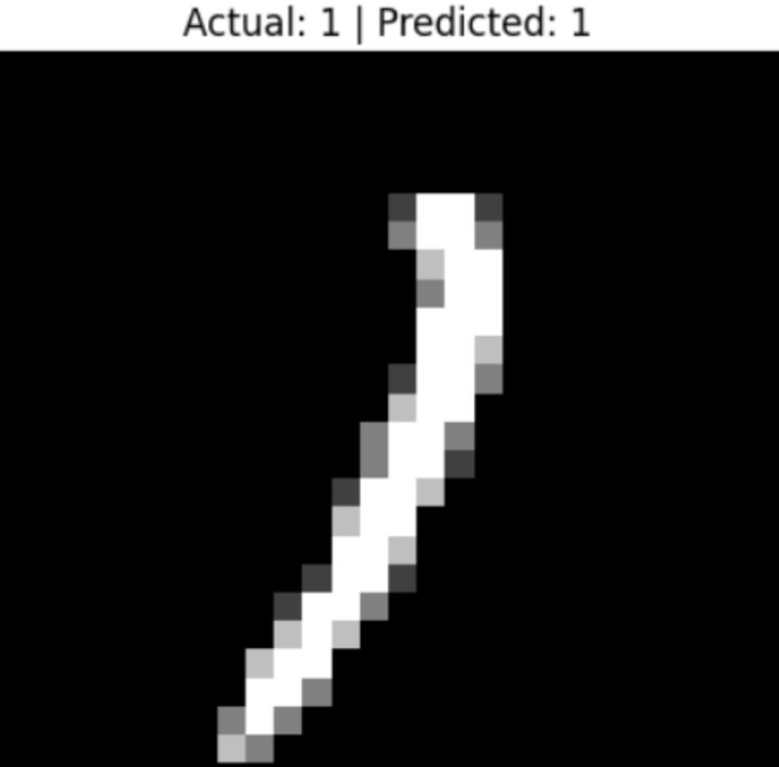
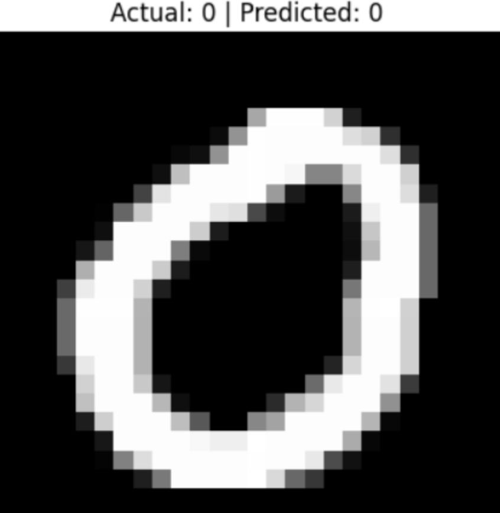
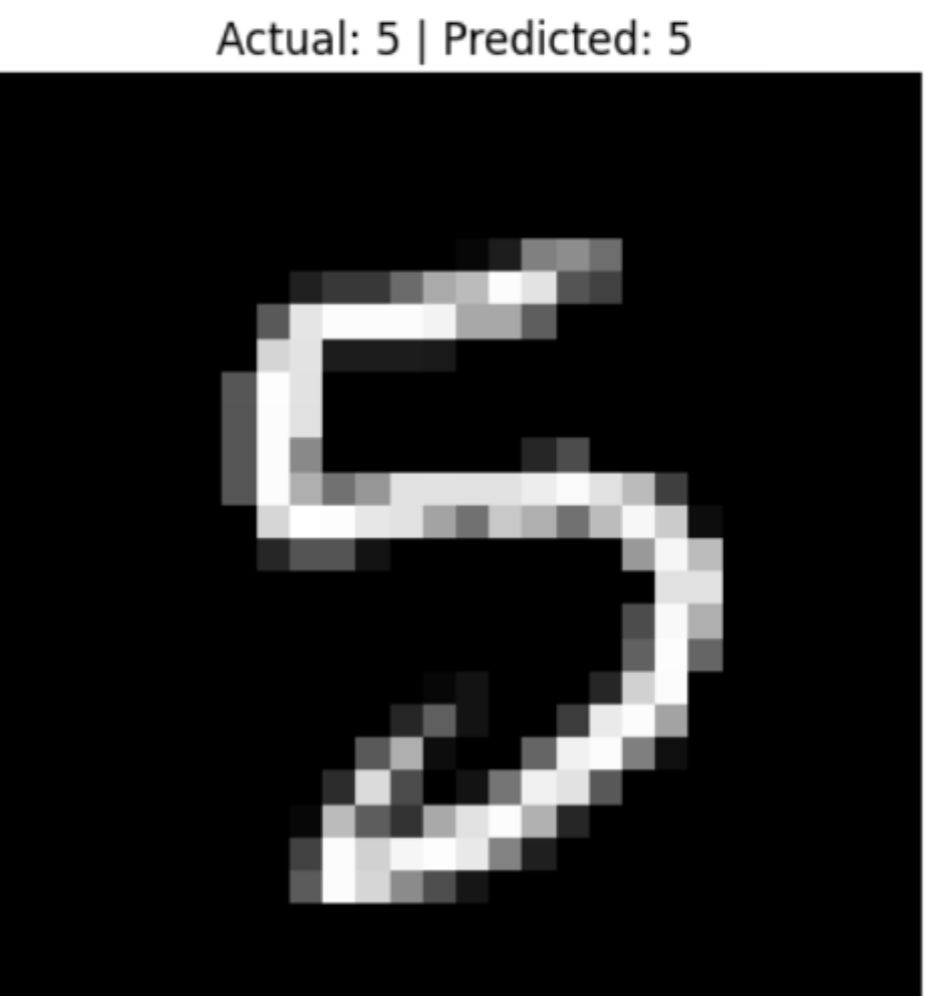
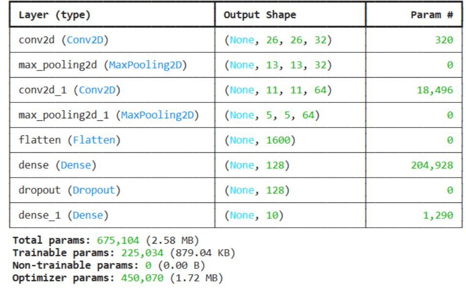

# 🧠 MNIST CNN Project

## 📌 Overview
This project implements a Convolutional Neural Network (CNN) using TensorFlow to classify handwritten digits from the MNIST dataset.

## 🚀 Features
- CNN with Conv2D + MaxPooling
- Dropout for regularization
- Accuracy & Loss visualization
- Random predictions display

## 🛠️ Tech Stack
- Python
- TensorFlow / Keras
- NumPy
- Matplotlib

## 📊 Model Architecture
- Conv2D (32 filters)
- MaxPooling
- Conv2D (64 filters)
- MaxPooling
- Dense (128)
- Dropout (0.3)
- Output layer (Softmax)

## 📈 Results
- Training Accuracy: ~99%
- Test Accuracy: ~98%
- ## 📷 Results

### 🔢 Sample Predictions

| Digit 1 | Digit 0 | Digit 5 |
|--------|--------|--------|
|  |  |  |

### 🧠 Model Architecture



## ▶️ How to Run

```bash
python -m venv venv
venv\Scripts\activate
pip install -r requirements.txt
python main.py
